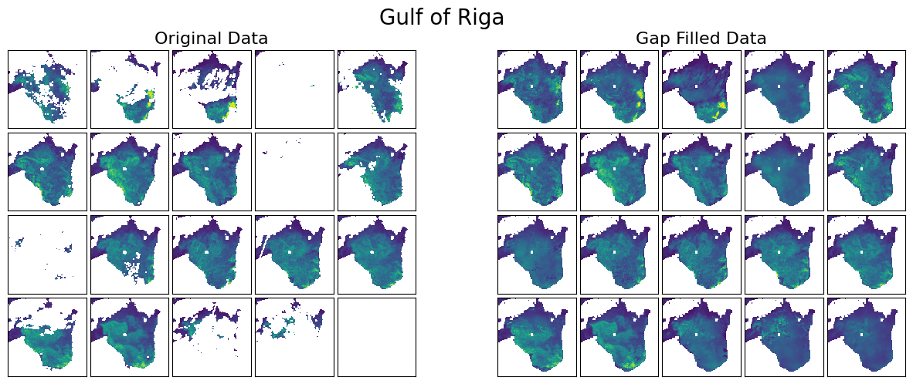
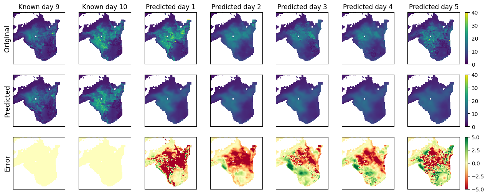

# Quantifying Plankton Populations in the Baltic Sea
### Utilizing Deep Learning Models to produce gap-free satellite images and perform predictions of the chlorophyll-a concentration in the Baltic Sea.

This repository holds the code for the Master thesis project of Nina Oehlckers.

The project aims to assess the usability of deep learning models to predict plankton populations in the Baltic Sea by training deep learning models on data derived from satellite imagery as well as oceanographic parameters. In order to do so, the goal is to first apply a deep learning model to fill gaps in the satellite-derived data that can be used as the input to the predicting deep learning model. The result is evaluated in comparison to the existing numerical model predictions as a baseline and in-situ data as ground-truth.

The project utilizes the following models:

| Project step | Model     | Author       | Paper   | GitHub |
|--------------|-----------|--------------|---------|--------|
| Gap-filling  | DINCAE v2 | Barth et al. | [DINCAEv1](https://doi.org/10.5194/gmd-15-2183-2022) | [https://github.com/gher-ulg/DINCAE.jl](https://github.com/gher-ulg/DINCAE.jl) |   
| Gap-filling  | DINCAE v1 | Barth et al. | [DINCAEv2](https://doi.org/10.5194/gmd-13-1609-2020) | [https://github.com/gher-uliege/DINCAE](https://github.com/gher-uliege/DINCAE) |
| Gap-filling  | STpconv   | Appel | [STpconv](https://arxiv.org/abs/2208.08781) | [https://github.com/appelmar/STpconv](https://github.com/appelmar/STpconv) |
| Prediction   | Sa-ConvLSTM | Lin et al. | [Sa-ConvLSTM](https://ojs.aaai.org//index.php/AAAI/article/view/6819) | [https://github.com/MahatmaSun1/SaConvSLTM/blob/041ecb020d151a21b4a1c3426c2e4e56269c5bff/SaConvSLTM/SaConvLSTM.py](https://github.com/MahatmaSun1/SaConvSLTM/blob/041ecb020d151a21b4a1c3426c2e4e56269c5bff/SaConvSLTM/SaConvLSTM.py) |

## Repository Structure

In the two step approach that is suggested in this study, the data is first gap-filled and the performance of the gap filling models are analysed and compared. Afterwards the gap-filled data is used for the predictions. 
The repository is organised in the different steps that were performed in the project

1. Data Downloading: Folder 00_Data_Download
2. Data Preparation: Folder 01_Data_Preparation
3. Gap-Filling of the data:
    - initial DINCAE model: Folder 11_DINCAE_python
    - modified DINpCAE model: Folder 12_DINpCAE_python
    - modified STpconv model: Folder 13_pCONV3D
4. Prediction of the CHL concentrations:
    - ConvLSTM model: Folder 21_ConvLSTM
    - Sa-ConvLSTM model: Folder 22_SaConvLSTM

## Example Results

Gap-Filling results using pCONV3D model for Gulf of Riga:

Prediction results 5 day in advance, using 10 historic days with ConvLSTM model:

